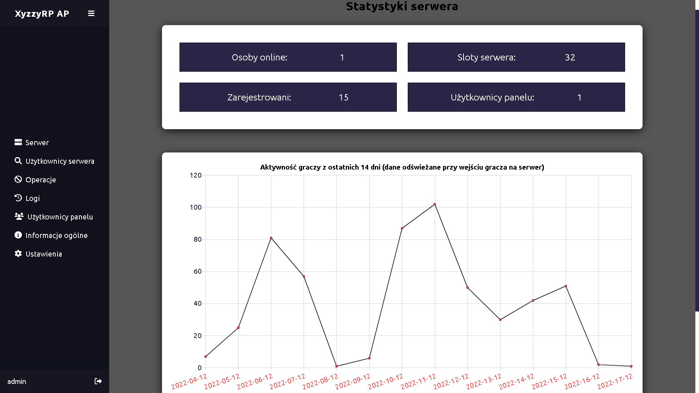

<h1>MTA XyzzyRP Web Administration Panel</h1>
<h1>PL</h1>
<h2>Opis panelu:</h2>

Internetowy panel administracyjny XyzzyRP został stworzony z myślą dla osób robiących serwer pod paczkę zasobów XyzzyRP oraz dla tych, którzy chcieliby wprowadzić na swój serwer pewne urozmaicenie. Panel posiada sporą ilość funkcji, statystyk itp. które pozwolą lepiej zarządzać swoim serwerem. Panel jest upowszechniony za w pełni za darmo oraz jest wydany na licencji MIT. Wszystkie problemy, pomysły oraz pytania można zadawać w zakładce <a href='https://github.com/NexON39/MTA-XyzzyRP-Web-Administration-Panel/issues'>Issues na githubie</a>, wiadomości prywatnej na discordzie czy e-mail. Chętnie odpowiem na wszystkie pytania. Panel jest w pełni responsywny oraz zoptymalizowany pod urządzenia mobilne

<h2>Wymagania:</h2>

    <ul>
        <li>PHP 7.1 lub wyższa (panel pisany na wersji 8.1.2)</li>
        <li>Serwer webowy na którym możemy uruchomić aplikację (Apache, nginx itp.)</li>
        <li>Baza danych mysql</li>
        <li>Serwer MTA z paczką zasobów XyzzyRP</li>
        <li>mtasa-php-sdk (Uwaga! Ten podpunkt można pominąć, ponieważ panel ma wbudowaną tę bibliotekę, lecz w razie problemów zapoznać się z instalacją dodatkowych pakietów php <a href='https://wiki.multitheftauto.com/wiki/PHP_SDK'>mtasa-php-sdk</a>, <a href='https://docs.php-http.org/en/latest/httplug/users.html'>HTTPlug</a>)</li>
        <li>Poprawnie skonfigurowany zasób XyzzyRP "DB", "DB2" oraz załadowany moduł mta_mysql.dll</li>
    </ul>
    Uwaga!
    Panel jest w pełni kompatybilny z oryginalną paczką zasobów XyzzyRP. W przypadku użycia nieoryginalnego kodu paczki zasobów może on nie być w pełni kompatybilny.

<h2>Instalacja:</h2>
    <ol>
        <li>Pobieramy repozytorium <a href='https://github.com/NexON39/MTA-XyzzyRP-Web-Administration-Panel'>MTA-XyzzyRP-Web-Administration-Panel</a>. Jeżeli używasz GITa możesz zrobić za pomocą polecenia  
        <code>$ git clone https://github.com/NexON39/MTA-XyzzyRP-Web-Administration-Panel</code></li>
        <li>Z folderu [requirements]/SQL wgrywamy skrukturę tabel bazy danych z pliku <code>XyzzyRP_AP.sql</code> do swojej bazy danych</li>
        <li>Na serwerze MTA tworzymy konto ACL o wybranym loginie i haśle np. Login: myUser, Hasło: myPassword</li>
        <li>Wgrywamy nasz zasób na serwer z folderu [requirements]/[xyyzyrp_ap]</li>
        <li>W pliku konfiguracyjnym ACL (acl.xml) w grupie 'Admin' dodajemy naszego użytkownika np. <code>&lt;object name="user.myUser"&gt;&lt;/object&gt;</code> oraz dodajemy obiekt naszego zasobu <code>&lt;object name="resource.xyzzyrp_ap_lua"&gt;&lt;/object&gt;</code></li>
        <li>Wgrywamy nasz panel administracyjny na serwer webowy</li>
        <li>Przechodzimy do pliku includes/dbconfig_class.php oraz konfigurujemy według podanego wzoru
            <code>
                  public $dbhost = "dbhost"; //host mysql (domyślnie localhost/127.0.0.1)
                  public $dbuser = "user"; //nazwa uzytkownika mysql (domyślnie root)
                  public $dbpass = "pass"; //hasło użytkownika mysql (domyślnie brak hasła)
                  public $dbname = "dbname"; //nazwa bazy danych
            </code>
        </li>
        <li>Przechodzimy do pliku includes/mtaconfig_class.php oraz konfigurujemy według podanego wzoru
            <code>
                  public $server_ip = "serverip"; //ip serwera (domyślny 127.0.0.1)
                  public $server_port = "serverport"; //port http serwera (domyślny 22005)
                  public $acl_user = "myUser"; //nazwa uzytkownika acl panelu (np. xyzzyrp_ap)
                  public $acl_pass = "myPassword"; //haslo uzytkownika acl panelu
            </code>
        </li>
        <li>Uruchamiamy zasób <code>xyzzyrp_ap_lua</code> na serwerze</li>
        <li>Wchodzimy na adres panelu i logujemy się (domyślny dodany użytkownik to login: admin, hasło: admin</li>
    </ol>
<h2>Główne funkcję panelu:</h2>
<ul>
    <li>Statystyki serwera (przegląd osób online z ostatnich 14 dni, liczba zarejestrowanych itp.)</li>
    <li>Dane użytkowników serwera (frakcje, domy itp.)</li>
    <li>Operacje na użytkownikach (ban, kick, aj, dodawanie gp itp.)</li>
    <li>Logi administracyjne panelu webowego</li>
    <li>Dodawanie oraz usuwanie użytkowników panelu</li>
    <li>Zmiana hasła oraz nicku w panelu</li>
    <li>Darkmode</li>
</ul>
<h2>Informację:</h2>

Autor: NexON39

Kontakt discord: NexON39#5665

Kontakt e-mail: kscode.pl@gmail.com

Wersja panelu: 1.0.0

W przyszłości planuję liczne aktualizację oraz nowości i mam nadzieję, że pomysł projektu się podoba i komuś się sprzyda ;)
<h2>Podgląd panelu:</h2>

  
<h1>EN</h1>
<h2>Panel description:</h2>

The XyzzyRP web administration panel was created for people who make a server for the XyzzyRP package and for those who would like to introduce some variety to their server. The panel has a large number of functions, statistics, etc. that will allow you to better manage your server. The panel is distributed for free and is released under the MIT license. All problems, ideas and questions can be asked in the tab <a href='https://github.com/NexON39/MTA-XyzzyRP-Web-Administration-Panel/issues'>Issues on github</a>, private message on discord or e-mail. I am happy to answer all your questions. The panel is fully responsive and optimized for mobile devices

<h2>Requirements:</h2>

    <ul>
        <li>PHP 7.1 or higher (panel written on version 8.1.2)</li>
        <li>A web server where we can run the application (Apache, nginx, etc.)</li>
        <li>Mysql database</li>
        <li>MTA server with XyzzyRP resource pack</li>
        <li>mtasa-php-sdk (Warning! This point can be omitted, because the panel has this library built-in, but in case of problems, see the installation of additional php packages <a href='https://wiki.multitheftauto.com/wiki/PHP_SDK'>mtasa-php-sdk</a>, <a href='https://docs.php-http.org/en/latest/httplug/users.html'>HTTPlug</a>)</li>
        <li>Correctly configured resource XyzzyRP "DB", "DB2" and loaded module mta_mysql.dll</li>
    </ul>
    Warning!
    The panel is fully compatible with the original XyzzyRP resource pack. If a non-genuine resource bundle code is used, it may not be fully compatible.

<h2>Installation:</h2>
    <ol>
        <li>We download the repository <a href='https://github.com/NexON39/MTA-XyzzyRP-Web-Administration-Panel'>MTA-XyzzyRP-Web-Administration-Panel</a>. If you are using GIT you can do it with the command  
        <code>$ git clone https://github.com/NexON39/MTA-XyzzyRP-Web-Administration-Panel</code></li>
        <li>From the [requirements] / SQL folder, load the structure of the database tables from the file <code>XyzzyRP_AP.sql</code> to your database</li>
        <li>On the MTA server, create an ACL account with the selected login and password, e.g. Login: myUser, Password: myPassword</li>
        <li>We upload our resource to the server from the [requirements] / [xyyzyrp_ap] folder</li>
        <li>In the ACL configuration file (acl.xml) in the 'Admin' group, add our user, e.g. <code>&lt;object name="user.myUser"&gt;&lt;/object&gt;</code> and add the object of our resource <code>&lt;object name="resource.xyzzyrp_ap_lua"&gt;&lt;/object&gt;</code></li>
        <li>We upload our administration panel to the web server</li>
        <li>We go to the file includes/dbconfig_class.php and configure according to the given pattern
            <code>
                  public $dbhost = "dbhost"; //host mysql (default localhost/127.0.0.1)
                  public $dbuser = "user"; //username mysql (default root)
                  public $dbpass = "pass"; //mysql user password (no password by default)
                  public $dbname = "dbname"; //database name
            </code>
        </li>
        <li>We go to the file includes/mtaconfig_class.php and configure according to the given pattern
            <code>
                  public $server_ip = "serverip"; // server ip (default 127.0.0.1)
                  public $server_port = "serverport"; // the server's http port (default 22005)
                  public $acl_user = "myUser"; // username acl of the panel (e.g. xyzzyrp_ap)
                  public $acl_pass = "myPassword"; // password for the acl user of the panel
            </code>
        </li>
        <li> Run resource <code> xyzzyrp_ap_lua </code> on the server </li>
        <li> Enter the panel address and log in (default user added is login: admin, password: admin </li>
    </ol>
<h2>The main functions of the panel:</h2>
<ul>
    <li> Server statistics (overview of people online for the last 14 days, number of registered users etc.) </li>
    <li> Data of server users (factions, houses etc.) </li>
    <li> Operations on users (ban, kick, aj, add gp etc) </li>
    <li> Web panel administration logs </li>
    <li> Add and remove panel users </li>
    <li> Changing the password and nickname in the panel </li>
    <li> Darkmode </li>
</ul>
<h2>Information:</h2>

Author: NexON39

Contact discord: NexON39 # 5665

Contact e-mail: kscode.pl@gmail.com

Panel version: 1.0.0

In the future, I plan numerous updates and news and I hope that the idea of ​​the project will be liked and will be beneficial to someone;)
<h2>Panel preview:</h2>

